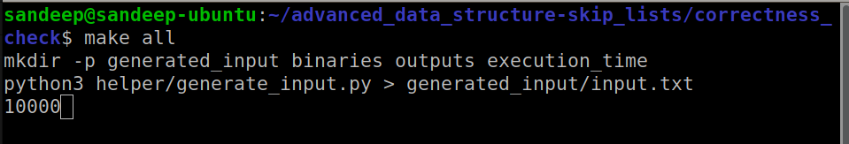
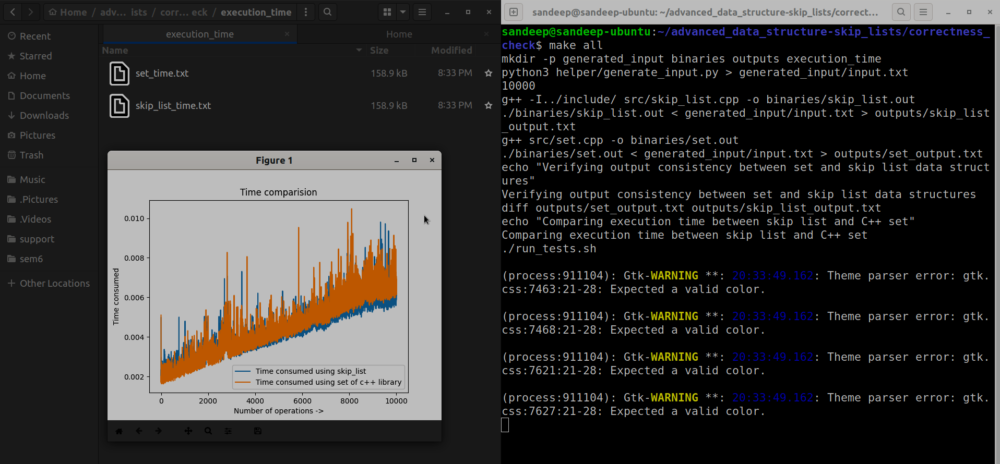
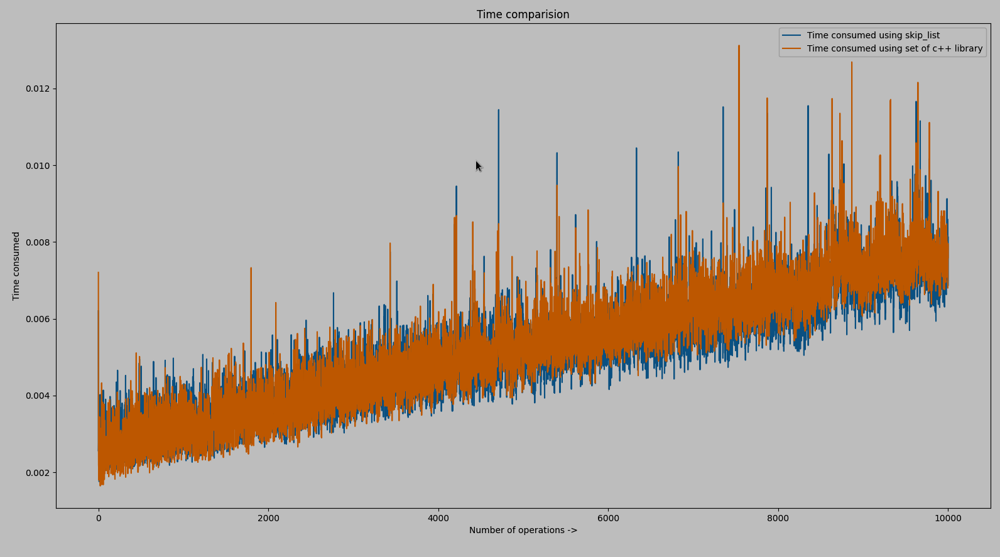

# Skip List in C++ 🚀

Welcome to my repository! Here, you’ll find my implementation of a **Skip List**, an advanced randomized data structure, in C++. This project includes a comparison of its performance and correctness against the C++ `set` container. This README will guide you through the project, providing an introduction to skip lists, instructions for running the code, and insights from the performance analysis. I hope you find it informative and enjoyable! 🎉

Happy Coding! 💻✨

## What is a Skip List? 🤔

A **Skip List** is a probabilistic data structure that allows for fast search, insertion, and deletion operations. Skip lists are an alternative to balanced trees (like AVL or Red-Black trees) and provide \(O(\log n)\) average time complexity for these operations, where \(n\) is the number of elements in the list.

### How Skip Lists Work

A skip list consists of multiple layers of linked lists. The bottom layer is an ordinary sorted linked list, and each higher layer acts as an "express lane" for faster access, containing a subset of the elements from the layer below. 

Here’s how the levels are organized:

1. **Level 0**: This is the base level and contains all elements in sorted order, just like a regular linked list.
2. **Higher Levels**: Each higher level contains fewer elements than the level below, typically every second element, providing a fast path through the list.

When searching for an element, you start at the topmost level and move forward until you find a node whose next node is greater than the target element or reaches the end. Then, drop down a level and continue until you reach the base level. This multi-level structure allows you to skip large portions of the list, leading to faster searches.

### Key Features of Skip Lists

- **Randomized Structure**: Unlike balanced trees, skip lists do not require complex rotations to maintain balance. Instead, they use randomization to ensure that elements are evenly distributed across the different levels.
- **Flexibility**: Skip lists are not strictly balanced, but their randomized nature ensures good average-case performance without the need for strict balancing rules.

## Table of Contents 📜

| Section | Description |
|:-------|:------------|
| [include](include/) | Contains the header file [skip_list.h](include/skip_list.h), which provides my **circular** implementation of the skip list. This header can be included to use the skip list as a library/API, abstracting the complex logic into a simple interface. If you're new to skip lists, check out this [MIT lecture](https://www.youtube.com/watch?v=2g9OSRKJuzM&t=1780s) for a great introduction. |
| [skipList_vs_set](skipList_vs_set/) | Contains scripts to compare the outputs and execution times of the C++ `set` and my skip list implementation (which is pretty cool!). For more details, see [this section](#skiplist_vs_set). |
| [src](src/) | Includes [source_code.cpp](src/source_code.cpp), which demonstrates insertion, search, and deletion operations on sample elements. For details on running this code and its output, see the section below. |

## Implementation Methodology 🧠

The implementation of this skip list is based on a **circular randomized structure**, which is an innovative approach that enhances the flexibility and efficiency of the data structure. 

### Key Characteristics of the Implementation

1. **Circular Structure**: The skip list is implemented as a circular linked list at each level. This design allows for efficient traversal of the list, reducing the overhead of moving through the levels and back to the start when searching for an element. The circular nature ensures that the end of the list wraps around to the beginning, which simplifies the implementation of some operations and can improve cache locality.

2. **Randomized Level Assignment**: During insertion, the level at which a new element is placed is determined randomly. This randomness ensures that the elements are distributed across levels in a way that balances the skip list without needing complex rebalancing algorithms. The result is an average time complexity of \(O(\log n)\) for insertion, deletion, and search operations.

3. **Efficient Operations**: The skip list supports:
   - **Insertion**: Adding a new element to the appropriate level(s) based on a randomized height.
   - **Deletion**: Removing an element from all levels in which it appears, ensuring that the list remains consistent.
   - **Search**: Quickly locating an element by moving through the levels from top to bottom, which allows the algorithm to "skip" large sections of the list.

### Advantages of This Implementation

- **Performance**: The circular and randomized nature of the implementation allows it to achieve high efficiency in practice, often matching or exceeding the performance of more complex data structures like balanced trees.
- **Versatility**: This implementation can be easily adapted for various applications, from in-memory databases to network routing and beyond.

This skip list implementation is robust and well-tested, ensuring that it performs well across a wide range of scenarios. The code quality is high, and it's designed to be both efficient and easy to use. 

## Running [source_code.cpp](src/source_code.cpp) 🏃‍♂️

To run the source code, navigate to the `src` directory and use the following commands:

```bash
g++ source_code.cpp
./a.out
```

### Sample Output

```
Skip list entries from bottom to top:
Level 0 : 12 
Level 1 : 12 

Skip list entries from bottom to top:
Level 0 : 10 12 
Level 1 : 12 

Skip list entries from bottom to top:
Level 0 : 10 11 12 
Level 1 : 12 

Skip list entries from bottom to top:
Level 0 : 3 10 11 12 
Level 1 : 12 

Search 2: 0
Search 7: 0
Search 3: 1
Search 10: 1
Search 11: 1
Search 12: 1
Search 28: 0

After removing 11
Skip list entries from bottom to top:
Level 0 : 3 10 12 
Level 1 : 12 

After removing 3
Skip list entries from bottom to top:
Level 0 : 10 12 
Level 1 : 12 

After removing 12
Skip list entries from bottom to top:
Level 0 : 10 

After removing 10
Empty skip list
```

**Note:** Since a skip list is a randomized data structure, its layout may vary with each execution. This is part of its design, providing efficient average-case performance.

## Comparing Skip List with C++ `set` 📊

In this section, I compare my skip list implementation with the C++ `set`, which is typically implemented as a Red-Black tree, to evaluate both correctness and performance.

### How to Run the Comparison

1. **Run the Comparison Script**: Navigate to the `skipList_vs_set` directory and use the command:
   ```bash
   make all
   ```
   You’ll be prompted to enter the number of operations to test. For example, entering `10000` runs the test with 10,000 operations.
   
   

2. **Correctness Check**:
   - A random input generator script ([generate_input.py](skipList_vs_set/helper/generate_input.py)) creates input data for both the skip list and the `set`.
   - The `diff` command checks for any discrepancies between the outputs of the skip list and the `set`.

3. **Performance Comparison**:
   - The same random input generator is used to measure execution time for both data structures with varying operation counts.
   - A plot is generated to visually compare the performance of the skip list and the `set`.

### Observations and Results 🏅

- **Correctness**: No output differences found! This indicates that my skip list implementation works as expected, matching the functionality of the `set`.
  
  

- **Performance**: The time taken by the skip list is comparable to the `set` in C++! This shows the efficiency of the skip list. The units of time on y-axis is seconds

  


# Skip List vs Set Performance Benchmark

This benchmark compares the execution times of two data structures: **Skip List** and **Set**, based on 10,000 test cases. The goal is to measure how closely the performance of the two structures aligns, using a calculated closeness percentage.

## Benchmark Details

- **Number of Tests**: 10,000
- **Input Generation**: Inputs are generated using the Python script `helper/generate_input.py`.
- **Measurement**: Execution times for both `skip_list` and `set` implementations are measured using the `date` command in nanoseconds.
- **Tools Used**:
  - **Binaries**: `skip_list.out` and `set.out`
  - **Helper Scripts**: `generate_input.py` (for input generation) and `plot_time.py` (for plotting results).

## Closeness Calculation

Closeness between the execution times of Skip List and Set is computed using the following formula:

```
closeness = (1 - abs(t1 - t2) / max(t1, t2)) * 100
```

Where:
- `t1`: Time taken by Skip List.
- `t2`: Time taken by Set.

## How to Run the Benchmark

1. Run [performance_check.ipynb](performance_check.ipynb)

## Results

- **Average Closeness**: `91.74%`
- **Median Closeness**: `93.17%`

These results indicate that the Skip List and Set implementations perform similarly in most test cases, with an average closeness of about 91.74%.


### Why Use Skip Lists?

- **⚡ Efficiency**: Skip lists provide fast average-case performance for search, insertion, and deletion operations. Just like quicksort 🌀, which might have a worse theoretical worst-case time complexity than merge sort, it often excels in real-world scenarios due to its practical efficiency.
- **🛠️ Flexibility**: The structure can easily be adjusted, and the randomized nature allows for good performance without strict balancing rules.
